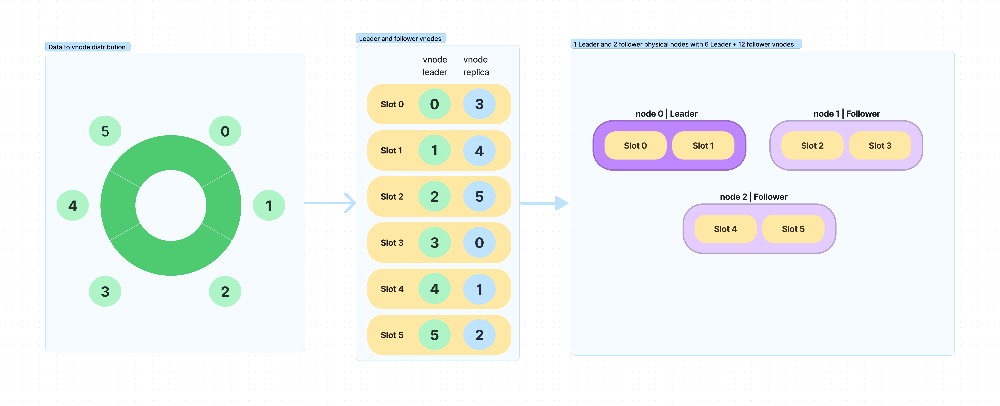

# 🔮 Architecture
We want to build a scalable, consistent, fault tolerant scheduler that is simple to use. Time machine is inspired by many projects
* [ScyllaDB](https://github.com/scylladb/scylladb) for ring architecture and distributed writes
* [CockroachDB](https://github.com/cockroachdb/cockroach) for consistency and scalability
* [Redis](redis.io) for its simplicity

## ⚙️ Design choices
* Node discovery, Failure detection, Membership management - Raft concensus
* Data replication, Consistency - Partitioned master slave with tunable consistency
* Load balancing, Data partitioning - Consistent hashing with `vnode` partitioning

## 🦋 Diagram


## ✏️ Definitions
### Terms
* `database` - A set of collections
* `collection` - Logical grouping of jobs
* `job` - A job holds information related to a task. This job is triggered at the `trigger_time`. It also contains `meta` information that can be saved while creating the job. This is passed on to the `recipient` at the trigger time.
* `route` - The routing information(webhook URL) used to publish a job.

### Components
* `cluster` - A set of timeMachine nodes that work together
* `node` - A physical server instance of timeMachine
* `vnode` - A subset of the collection stored in sorted order. The resident vnode of a `job` can be found by using the hash function on the `job_id`. Refer [vnode](#vnode)
* `replica` A copy of the vnode. The number of replicas can be specified during collection creation. The replicas are distributed such that one node has only one copy.

### Actors
* `creator` - the service which created this job
* `recipient` - the service which receives the trigger. Currently, only REST Webhook is supported
* `node leader` - The leader node. The leader will be selected based on raft consensus algorithm
* `vnode-leader` - the leader vnode elected to trigger jobs for a particular time slot among the vnode replicas. This ensures true distributed nature of the scheduler
* `admin` - a human who has special privileges to manually trigger compaction, rebalance etc. These operations are supposed to be executed with care under low-traffic conditions. I'm sorry, robots aren't allowed.

## 🎰 Behaviour
### Saving and triggering a job
A job can be created by using [developer APIs](./DevAPI.md#create-a-job) by providing `trigger_time`, `route` and `meta`(optional). Upon saving, the job is written to all the vnodes including leader and followers. 
When the `trigger_time` is reached, the job is fetched by the leader and published to the webhook URL provided in the `route`.

### Routing a webhook
A route can be created by using the [developer APIs](./DevAPI.md#create-a-job). At the trigger time, timeMachine makes a POST call to the webhook url provided with the response(same as the success GET response).

### vnode
A vnode is a subset of a collection of jobs that are stored in sorted order. Overall, a collection will have a `num_vnodes` number of vnodes evenly spread across the cluster. The default value is 12 `(LCM{3,4})`. A physical node will be assigned multiple non-contiguous vnodes. In case of scale-up or down, vnodes as a whole will be transferred over to the new nodes. This will make it easier to rebalance a timeMachine cluster.

### Trigger exactly once semantic
To make sure that a job is triggered exactly once, timeMachine elects a leader for every vnode for a time slot. This vnode-leader is responsible to trigger the job and publish the offset location for this particular vnode. One physical node may contain multiple vnode leaders. In case a vnode leader fails, a follower vnode becomes the leader and takes the responsibility of publishing the job from the latest committed offset. For leader election, timeMachine will use [Raft consensus algorithm](https://raft.github.io/). #TODO: Revisit

### Ring Architecture
When a job is saved in timeMachine, a [hash partitioner algorithm](#hash-partitioner-algorithm)(with `job_id` as an input) determines the vnode number to which this job will be assigned. The job will be published to all the nodes that contain the vnode (both followers and leaders). 

### Conflict resolution
To be done

### Hash partitioner algorithm
Time machine DB uses [xxHash](https://cyan4973.github.io/xxHash/) to hash the job_id and the slot is calculated as follows
```
> Slot Number = xxHash(job_id) % no of slots
```
The location of the node for a key is derived from the dht. You can read more about this in the [DHT component](/components/dht/dht.md)

### RPCs and message passing
refer [MessagePassing](./MessagePassing.md)

## 💡 Inspirations
* [Designing Data-Intensive Applications](https://www.oreilly.com/library/view/designing-data-intensive-applications/9781491903063/)
* [ScyllaDB](https://github.com/scylladb/scylladb)
* [Raft consensus algorithm](https://raft.github.io/)